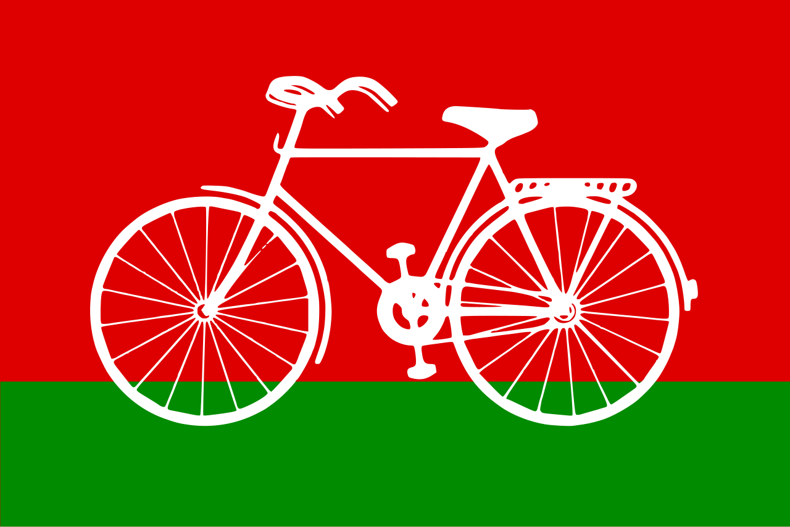

# 🗳️ Election Voting System

A fully client-side **digital election voting portal** built with plain HTML, CSS, and vanilla JavaScript. It simulates a real-world online voting system with user registration, OTP verification, secure voting, live results, and password recovery — all powered by the browser's `localStorage`.

---

## 📸 Pages Overview

| Page | File | Description |
|------|------|-------------|
| Landing Page | `index.html` | Public homepage with party info, how-it-works, and Vote Now modal |
| Login | `login.html` | Voter login with email & password |
| Register | `signup.html` | New voter registration with OTP verification |
| Dashboard | `main.html` | Protected dashboard shown after login |
| Cast Vote | `vote.html` | 3-step voting flow: Select → Confirm → Receipt |
| Live Results | `results.html` | Real-time vote tally with tie detection |
| Forgot Password | `forgot-password.html` | 3-step password reset flow |

---

## ✨ Features

### 🔐 Authentication
- User registration with full validation (name, email, Voter ID, Aadhaar, date of birth, password)
- Mobile OTP simulation (demo alert — no SMS backend required)
- Login with email and password matched against `localStorage`
- Session management via `localStorage` (`evs_session`)
- Auto-redirect if already logged in
- Logout from any page

### 📝 Registration Validation
- Full name — letters only, minimum 3 characters
- Mobile number — 10-digit format
- Email — standard format check
- Voter ID — exactly 10 alphanumeric characters (e.g. `ABC1234567`)
- Aadhaar — exactly 12 digits
- Date of Birth — must be 18+ years old
- Password — minimum 8 characters with uppercase, number, and special character
- Confirm password match
- Duplicate email and Voter ID detection
- Real-time inline validation on blur

### 🗳️ Voting
- Auth-guarded — redirects to login if not logged in
- Double-vote prevention — already-voted users are redirected to results
- 3-step flow with animated progress tracker
- 5 options: BJP, INC, AAP, SP, NOTA
- Vote confirmation screen before final submission
- Unique vote receipt generated with receipt ID, timestamp, and party name
- Vote stored in `evs_votes` tally in `localStorage`

### 📊 Live Results
- Real-time vote count from `localStorage`
- Parties ranked by vote count (descending)
- **Tie detection** — when two or more parties have equal votes, shows "Tied" badge (orange) instead of falsely crowning a winner
- Only a party with strictly more votes than all others gets the green "Leading" badge
- Progress bars showing percentage share
- Summary stats: total votes, leading party, leading share, registered voters
- Auto-refreshes every 10 seconds

### 🔑 Forgot Password
- 3-step flow: enter email → verify reset code → set new password
- Verifies email exists in `localStorage` before sending code
- Demo reset code shown via browser alert
- Updates password in `localStorage` and clears active session

---

## 🗂️ Project Structure

```
Election_Voting_System/
│
├── index.html              # Public landing page
├── login.html              # Login page
├── signup.html             # Registration page
├── main.html               # Protected dashboard (requires login)
├── vote.html               # Voting page (requires login)
├── results.html            # Live results page
├── forgot-password.html    # Password reset page
│
├── styles.css              # Styles for auth pages (login, signup, forgot)
├── main.css                # Styles for main dashboard & landing page
├── vote.css                # Styles for voting & results pages
│
├── script.js               # Login page logic
├── signup.js               # Registration logic & OTP
├── main.js                 # Dashboard logic & auth guard
├── vote.js                 # Voting flow logic
├── forgot-script.js        # Password reset logic
├── logos.js                # Party logo file paths (shared across all pages)
│
├── BJP.png                 # BJP party logo
├── INC.png                 # Indian National Congress logo
├── AAP.png                 # Aam Aadmi Party logo
├── SP.png                  # Samajwadi Party logo
└── Nota.jpg                # NOTA (None of the Above) image
```

---

## 🚀 Getting Started

No server, no build tools, no dependencies to install.

### Run locally

1. Clone or download this repository
2. Open `index.html` in any modern browser

```bash
git clone https://github.com/your-username/Election_Voting_System.git
cd Election_Voting_System
# Open index.html in your browser
```

### Demo flow

1. Open `index.html`
2. Click **Sign Up** → fill in the registration form
   - Use any 10-char Voter ID e.g. `ABC1234567`
   - Use any 12-digit Aadhaar e.g. `123456789012`
   - OTP is optional — click Send OTP, note the code from the alert, enter it, or skip
3. Login with your registered email and password
4. Click **Vote Now** on the dashboard
5. Select a party → Confirm → view your receipt
6. Click **View Live Results** to see the tally

---

## 💾 Data Storage

All data is stored in the browser's `localStorage` under these keys:

| Key | Contents |
|-----|----------|
| `evs_users` | Array of all registered user objects |
| `evs_session` | Currently logged-in user object |
| `evs_votes` | Vote tally object `{ BJP: 3, Congress: 2, ... }` |

### User object schema
```json
{
  "id": 1718000000000,
  "name": "Rahul Sharma",
  "mobile": "9876543210",
  "email": "rahul@example.com",
  "voterId": "ABC1234567",
  "aadhar": "123456789012",
  "dob": "1995-06-15",
  "password": "Pass@1234",
  "hasVoted": true,
  "votedFor": "AAP",
  "receiptId": "RCP-ABC123",
  "votedAt": "04/06/2026, 10:30:00 am",
  "registeredAt": "2026-06-04T10:00:00.000Z"
}
```

> ⚠️ Passwords are stored in plain text in `localStorage` because this is a **frontend-only demo**. A production system must hash passwords server-side and use a real database.

---

## 🏛️ Participating Parties

| Logo | Short Name | Full Name | Ideology |
|------|-----------|-----------|----------|
|  | BJP | Bharatiya Janata Party | Nationalism, economic reforms |
|  | INC | Indian National Congress | Democracy, secularism, social justice |
|  | AAP | Aam Aadmi Party | Anti-corruption, governance transparency |
|  | SP | Samajwadi Party | Socialism, equality, welfare |
|  | NOTA | None of the Above | Right to reject all candidates |

---

## 🛠️ Tech Stack

| Technology | Usage |
|-----------|-------|
| HTML5 | Page structure and markup |
| CSS3 | Styling, animations, responsive layout |
| Vanilla JavaScript (ES6+) | All logic, validation, DOM manipulation |
| localStorage API | Persistent data storage |
| Font Awesome 6 | Icons throughout the UI |
| Google Fonts (Poppins) | Typography on dashboard |

---

## 📱 Responsive Design

The site is fully responsive and works on:
- Desktop browsers (Chrome, Firefox, Edge, Safari)
- Tablets
- Mobile phones

Breakpoints are handled via CSS media queries at `768px` and `480px`.

---

## ⚠️ Limitations (Frontend Demo)

Since this is a **client-side only** project:

- ❌ No real OTP is sent — the code is shown in a browser `alert()` for demo purposes
- ❌ No real email is sent for password reset — reset code shown via `alert()`
- ❌ Passwords stored in plain text in `localStorage`
- ❌ No backend — all data is lost when browser storage is cleared
- ❌ No server-side vote integrity verification
- ❌ Multiple browsers/devices do not share data

For a production system, you would need:
- A backend (Node.js / Django / etc.) with a database
- Bcrypt password hashing
- Real SMS/email OTP service (Twilio, SendGrid, etc.)
- JWT or session-based authentication
- Server-side vote integrity and audit logs

---

## 🐛 Known Bugs Fixed

| Bug | Description | Fix |
|-----|-------------|-----|
| Signup did nothing | OTP verification was required but not clearly communicated; blocked form submission silently | Made OTP optional in demo mode; added visible red error messages and auto-scroll to first error |
| Party logos not showing | External image URLs (Wikipedia SVG thumbs, India Today CDN) returned 400/422/timeout due to hotlink blocking | Replaced with local image files (`BJP.png`, `INC.png`, etc.) referenced via `logos.js` |
| Wrong "Leading" party shown | JavaScript `.sort()` on tied vote counts used unstable ordering, making the party listed earlier in the array win the tie | Added explicit tie detection; tied parties show an orange "Tied" badge; only strict winner gets "Leading" |
| `results.html` missing | `vote.js` redirected to `results.html` after voting but the file didn't exist | Created `results.html` with full live results UI |

---

## 📄 License

This project is open source and available under the [MIT License](LICENSE).

---

## 👨‍💻 Author

Built as a frontend demo project for learning and portfolio purposes.

Feel free to fork, improve, and use it as a base for a full-stack voting system.
